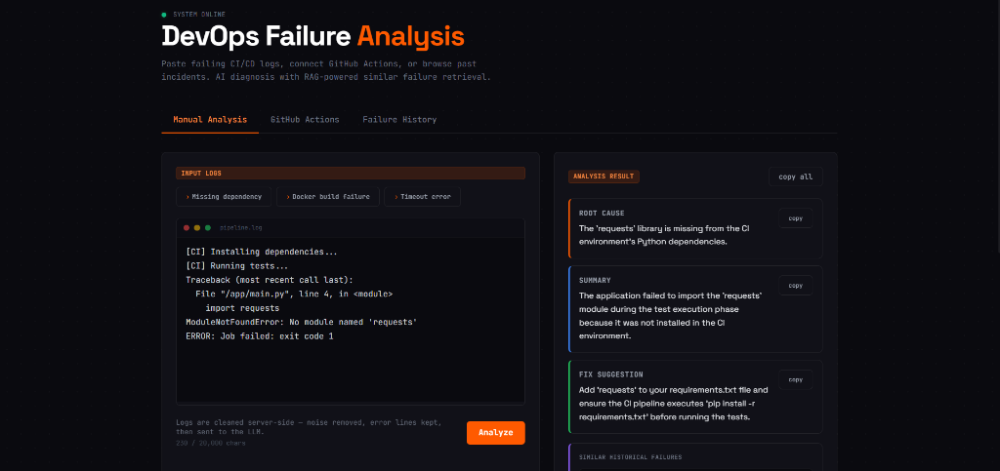
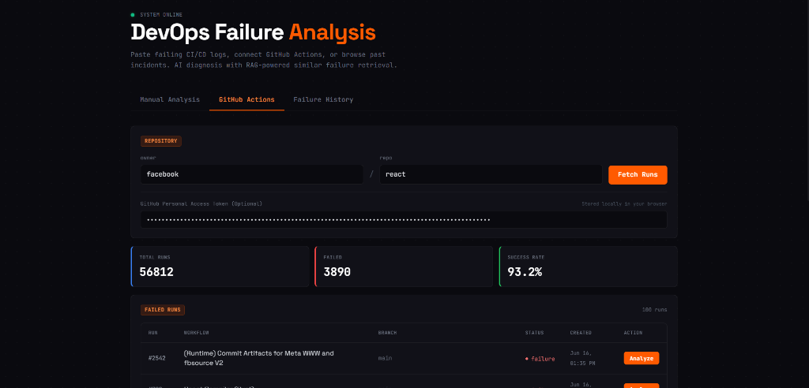
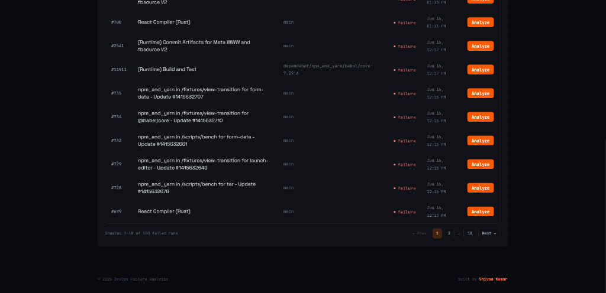
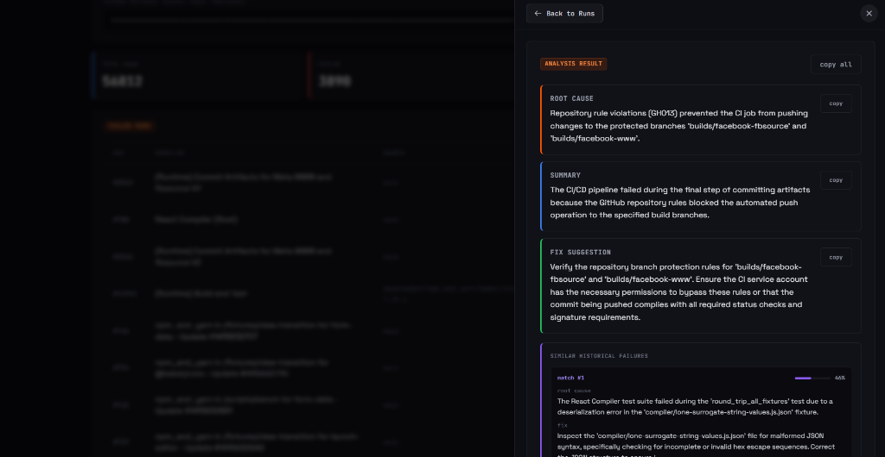
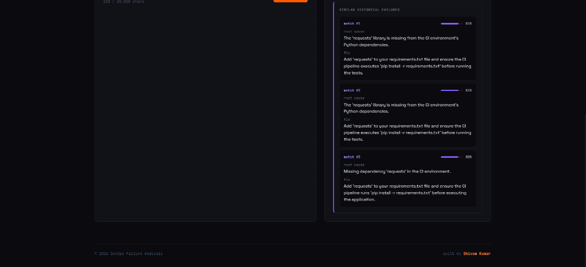

<div align="center">

# 🔍 DevOps Failure Analysis Platform

### AI-Powered CI/CD Log Diagnostics with RAG Similarity Search

[](https://llm-powered-devops-failure-analysis.onrender.com/)

🔗 **[Try the Live App on Render](https://llm-powered-devops-failure-analysis.onrender.com/)**

<br />

### Tech Stack
[](https://python.org)
[](https://fastapi.tiangolo.com)
[](https://react.dev)
[](https://ai.google.dev)

<br />

A full-stack AIOps platform that **analyzes CI/CD failure logs with AI**, **tracks historical incidents**, and **retrieves similar past failures using RAG** (Retrieval-Augmented Generation) — so your team spends less time debugging and more time shipping.

</div>

---

## 📸 Screenshots

### Manual Log Analysis

Paste any CI/CD log — from GitHub Actions, and get an instant AI-powered diagnosis with root cause, summary, and actionable fix suggestions. Includes sample log templates to try it out immediately.



---

### GitHub Actions Integration

Connect any public or private GitHub repository. The platform fetches all failed workflow runs, displays live stats (total runs, failed count, success rate), and lets you analyze any failure with a single click.



---

### Paginated Failed Runs Table

Browse through hundreds of failed runs with client-side pagination. Each row shows the run number, workflow name, branch, failure status, and creation timestamp — with an **Analyze** button for one-click diagnosis.



---

### AI Analysis Slide-Over Panel

When you click **Analyze**, a slide-over panel opens with the full AI diagnosis: root cause, summary, and fix suggestion — each with copy buttons. The panel has a fixed header so you can always navigate back, even after scrolling.



---

### RAG-Powered Similar Failures

Every analysis automatically retrieves similar historical failures from the vector database. Each match shows its root cause, fix, and a similarity score — helping teams spot recurring patterns and apply proven solutions.



---

## ✨ Key Features

| Feature | What It Does |
|---------|-------------|
| **🤖 AI-Powered Diagnostics** | Paste logs from any CI/CD platform → get instant root cause, summary, and fix via Gemini AI |
| **🔗 GitHub Actions Integration** | Connect repos → auto-fetch failed runs → one-click analysis with live stats |
| **🧠 RAG Similarity Search** | Every analysis retrieves the top 3 similar past failures from ChromaDB to improve accuracy |
| **📜 Failure History** | Full incident history with search, stored in SQLite — every analysis is tracked |
| **🛡️ Graceful Degradation** | If Gemini is down, a regex-based fallback analyzer still produces useful diagnostics |
| **🔑 Custom PAT Support** | Bring your own GitHub token for private repos — stored locally in your browser, never on the server |
| **📊 Live Stats** | Real-time total runs, failed count, and success rate for any connected repository |

---

## 🏗️ Architecture

### How the Analysis Pipeline Works

Every log analysis (manual paste or GitHub Actions) flows through the same unified pipeline:

```
User Input (paste logs or click "Analyze")
       |
       v
 1. CLEAN LOGS
    Strip ANSI codes, remove noise lines, extract error-focused lines
       |
       v
 2. RAG RETRIEVAL
    Query ChromaDB for top-3 similar past failures (L2 distance)
       |
       v
 3. ENRICHED PROMPT
    Combine current logs + similar failures into a structured prompt
       |
       v
 4. GEMINI ANALYSIS
    Structured JSON output (root_cause, summary, fix) via Pydantic
       |
       v
 5. STORE RESULTS
    SQLite (incident DB) + ChromaDB (vector embedding)
       |
       v
 6. RETURN RESPONSE
    Root cause + summary + fix + similar historical matches
```

### Key Design Decisions

- **Zero-Bloat AI Integration** — No LangChain or heavy frameworks. Direct Gemini SDK calls with Pydantic-enforced structured output for maximum speed and predictability.
- **Local Embeddings** — RAG uses `all-MiniLM-L6-v2` running on CPU. No external embedding API costs or latency.
- **Repository Pattern** — SQLite access is abstracted behind a repository layer, making it trivial to swap in PostgreSQL later.
- **Resilient Fallback** — If the LLM is unavailable, a regex-based fallback analyzer detects common patterns (missing deps, timeouts, auth failures, port conflicts) and produces structured output.
- **Auto-Redirect Handling** — All GitHub API calls follow 301 redirects automatically, so renamed/moved repos don't break the app.

---

## 🧰 Tech Stack

| Layer | Technology | Purpose |
|-------|-----------|---------|
| **Backend** | FastAPI (Python 3.12) | Async REST API with automatic OpenAPI docs |
| **Frontend** | React 18 + Vite | Single-page app with dark theme UI |
| **LLM Engine** | Gemini API (`google-genai` SDK) | Structured log analysis with JSON output |
| **Vector DB** | ChromaDB + `all-MiniLM-L6-v2` | Local embeddings for RAG similarity search |
| **Database** | SQLite via `aiosqlite` | Async incident history storage |
| **HTTP Client** | `httpx` (async) | GitHub API integration with redirect support |
| **Deployment** | Docker + Render | Multi-stage build, persistent disk for data |

---

## 📁 Project Structure

```
root/
├── Dockerfile                       # Multi-stage build (Node → Python)
├── render.yaml                      # Render deployment config with persistent disk
├── run.bat                          # Windows: launch backend + frontend together
│
├── backend/
│   ├── main.py                      # FastAPI app entry point + lifespan setup
│   ├── config.py                    # Settings from environment variables
│   ├── models/
│   │   └── schemas.py               # Pydantic request/response schemas
│   ├── routes/
│   │   ├── analysis_routes.py       # POST /analyze/enriched
│   │   ├── github_routes.py         # GitHub Actions API endpoints
│   │   └── history_routes.py        # GET /history, /history/{id}
│   ├── services/
│   │   ├── analysis_pipeline.py     # Unified 7-step analysis pipeline
│   │   ├── llm_service.py           # Gemini structured output integration
│   │   ├── log_cleaner.py           # ANSI stripping, noise removal, error focus
│   │   ├── github_service.py        # GitHub API (workflows, runs, logs)
│   │   ├── fallback_analyzer.py     # Regex-based fallback when LLM is unavailable
│   │   └── rate_limiter.py          # In-memory sliding window rate limiter
│   ├── database/
│   │   ├── schema.py                # SQLite table creation
│   │   └── repository.py            # Async CRUD for incidents
│   └── rag/
│       ├── chroma_client.py         # ChromaDB collection management
│       ├── embeddings.py            # Embedding text generation
│       └── retriever.py             # Store + retrieve similar failures
│
└── frontend/
    ├── src/
    │   ├── App.jsx                  # Main app with tab navigation
    │   ├── api.js                   # Centralized API client with PAT support
    │   ├── index.css                # Global dark theme styling
    │   └── components/
    │       ├── ManualAnalysis.jsx    # Log paste + sample templates
    │       ├── GitHubAnalysis.jsx    # Repo connector + runs display
    │       ├── FailureHistory.jsx    # Searchable incident history
    │       ├── RepoSelector.jsx     # Owner/repo input + PAT field
    │       ├── FailedRunsTable.jsx   # Paginated failed runs table
    │       ├── AnalysisPanel.jsx     # AI diagnosis result cards
    │       ├── AnalysisModal.jsx     # Slide-over panel with fixed header
    │       ├── SimilarFailures.jsx   # RAG match cards with scores
    │       ├── ResultCard.jsx        # Copy-enabled result sections
    │       ├── WorkflowStats.jsx     # Total/failed/success rate stats
    │       ├── LogInput.jsx          # Log textarea with char counter
    │       ├── ToastNotification.jsx # Animated toast messages
    │       ├── LoadingState.jsx      # Skeleton loading indicator
    │       └── ErrorState.jsx        # Error display component
    └── vite.config.js
```

---

## 📡 API Reference

| Method | Endpoint | Description |
|--------|----------|-------------|
| `GET` | `/health` | Health check — returns `{ "status": "ok" }` |
| `POST` | `/analyze/enriched` | Analyze pasted logs with LLM + RAG |
| `GET` | `/github/workflows?owner=X&repo=Y` | List all workflows for a repo |
| `GET` | `/github/runs/failed?owner=X&repo=Y` | Get failed runs with stats |
| `POST` | `/github/analyze-run/{run_id}` | Analyze a specific workflow run |
| `GET` | `/history?page=1&page_size=20` | Paginated failure history |
| `GET` | `/history/{id}` | Get a specific incident by ID |

> All GitHub endpoints accept an optional `X-GitHub-Token` header for private repo access.

---

## 🚀 Quick Start

### Prerequisites

- Python 3.12+
- Node.js 18+
- [Gemini API Key](https://ai.google.dev/) (required)
- [GitHub PAT](https://github.com/settings/tokens) (optional — for private repos or higher rate limits)

### 1. Clone & Configure

```bash
git clone https://github.com/shivamkr1353/DevOps-Failure-Analysis-Platform-with-RAG.git
cd DevOps-Failure-Analysis-Platform-with-RAG

# Configure environment
cp backend/.env.example backend/.env
# Edit backend/.env and add your GEMINI_API_KEY (and optionally GITHUB_TOKEN)
```

### 2a. Windows — Automated Launch

```bash
# Install dependencies (first time only)
cd backend && python -m venv ..\.venv && ..\.venv\Scripts\python -m pip install -r requirements.txt
cd ../frontend && npm install
cd ..

# Launch both servers
.\run.bat
```

### 2b. Manual Setup (Linux/macOS)

**Backend:**

```bash
cd backend
python -m venv .venv
source .venv/bin/activate
pip install -r requirements.txt
cp .env.example .env        # Add your GEMINI_API_KEY
uvicorn main:app --reload --port 8000
```

**Frontend:**

```bash
cd frontend
npm install
cp .env.example .env
npm run dev
```

### 3. Open the App

Visit `http://localhost:5173` (Vite dev server) or `http://localhost:8000` (if serving frontend from backend).

---

## 🐳 Docker Deployment

The project uses a multi-stage Docker build (Node for frontend → Python for backend):

```bash
docker build -t devops-failure-analysis .

docker run -p 8000:8000 \
  -v devops-data:/app/backend/data \
  --env GEMINI_API_KEY=your_key \
  --env GITHUB_TOKEN=your_token \
  devops-failure-analysis
```

The persistent volume at `/app/backend/data` stores both the SQLite database and ChromaDB vector store, so your failure history and RAG embeddings survive container restarts.

---

## ☁️ Render Deployment

This project includes a `render.yaml` for one-click deployment to [Render](https://render.com):

- **Runtime**: Docker
- **Persistent Disk**: 1 GB mounted at `/app/backend/data` for SQLite + ChromaDB
- **Health Check**: `/health` endpoint
- **Auto-Deploy**: On every push to `main`

Set `GEMINI_API_KEY` and (optionally) `GITHUB_TOKEN` as environment variables in the Render dashboard.

---

## 🧪 How It Handles Edge Cases

| Scenario | Behavior |
|----------|----------|
| **Gemini API down** | Falls back to regex-based pattern matching (missing deps, timeouts, auth errors) |
| **ChromaDB empty** | Skips RAG retrieval, analyzes with LLM only — no crash |
| **GitHub repo renamed** | Automatically follows 301 redirects with a clear error message if needed |
| **Rate limit exceeded** | Returns a user-friendly message with retry-after timing |
| **Invalid PAT** | Specific 401 error message suggesting token refresh |
| **No failed runs found** | Returns 404 with clear "no failures" message |
| **Very large logs** | Cleaned and trimmed to 120 focused error lines before sending to LLM |

---

## 📄 License

MIT

---

<div align="center">

**Built by [Shivam Kumar](https://github.com/shivamkr1353)**

</div>
